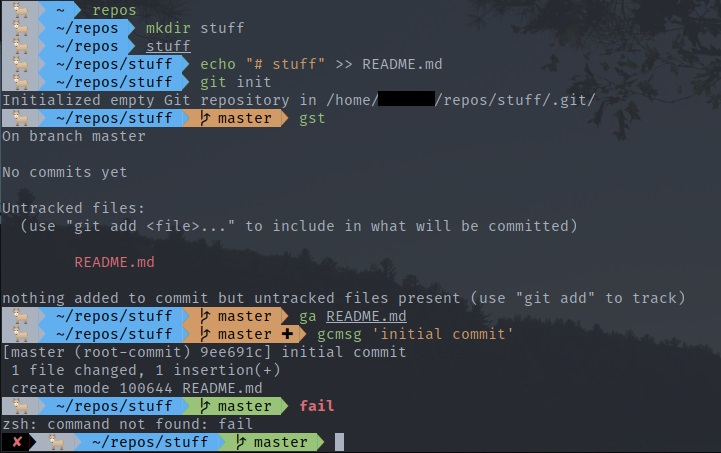

# Terminal Setup Linux Mint


## Install zsh
1. `sudo apt install zsh`
    - Check version `zsh --version`
2. Set zsh as the default `chsh -s $(which zsh)`
    - Check zsh is an authorised shell `cat /etc/shells`
3. Logout
4. Check shell, `echo $SHELL`, `$SHELL --version`

## Install Oh-My-Zsh
`sh -c "$(curl -fsSL https://raw.githubusercontent.com/ohmyzsh/ohmyzsh/master/tools/install.sh)"`

### Configure theme
1. Set zsh theme to 'agnoster', open `~/.zshrc` and edit `ZSH_THEME="agnoster"`
    - Requires Powerline fonts to render special characters `sudo apt-get install fonts-powerline`
2. Configure prompt, remove user@hostname from prompt, add random emoji by adding to the bottom of `~/.zshrc`
```bash
prompt_context() {
    emojis=("🚀" "🔥" "👏" "🙌" "👍" "👋" "🎉" "🌮" "🤙" "🐐" "🦍" "🦄" "🛰" "📡" "☄" "🌑" "🌕" "🤖" "👽" "👾" "🎃" "💸")
    RAND_EMOJI=$(( $RANDOM % ${#emojis[@]} + 1 ))
    prompt_segment white default "${emojis[$RAND_EMOJI]}"
}
```
3. Colour theme, Edit > Preferences > Colours then disable 'Use colours from the system theme', now you can install One Dark theme  
`bash -c "$(curl -fsSL https://raw.githubusercontent.com/denysdovhan/gnome-terminal-one/master/one-dark.sh)"`  
then restart the terminal
4. Font, Edit > Preferences > Custom font > Fira Code Regular 11pt
5. Command auto suggestions, add zsh-autosuggestions plugin, navigate to the oh-my-zsh plugins directory `.oh-my-zsh/custom/plugins`, clone the plugin repo  
`git clone https://github.com/zsh-users/zsh-autosuggestions`  
add `zsh-autosuggestions` to ~/.zshrc plugins list .ie `plugins=(git zsh-syntax-highlighting zsh-autosuggestions)` 
6. Command highlighting, add zsh-syntax-highlighting plugin, navigate to the oh-my-zsh plugins directory `.oh-my-zsh/custom/plugins`, clone the plugin repo  
`git clone https://github.com/zsh-users/zsh-syntax-highlighting`  
add `zsh-syntax-highlighting` to ~/.zshrc plugins list .ie `plugins=(git zsh-syntax-highlighting)`  

## Add aliases
### File path
Add directory aliases to `.zshrc`  
`alias codes="~/code"`  
`alias repos="~/repos"`  

## References
<a href="https://github.com/ohmyzsh/ohmyzsh">oh-my-zsh github</a>  
<a href="https://github.com/powerline/fonts">Powerline fonts repo</a>  
<a href="https://github.com/denysdovhan/one-gnome-terminal">One Dark theme for gnome terminal</a>  
<a href="https://github.com/zsh-users/zsh-autosuggestions">zsh-autosuggestions</a>  
<a href="https://github.com/zsh-users/zsh-syntax-highlighting">zsh-syntax-highlighting</a>  

## Miscellaneous
- powerlevel9k or powerlevel10k
- Meslo font